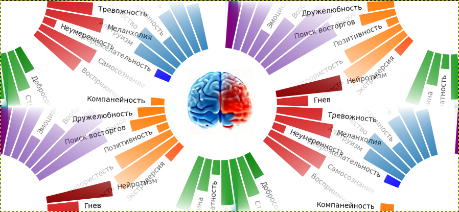
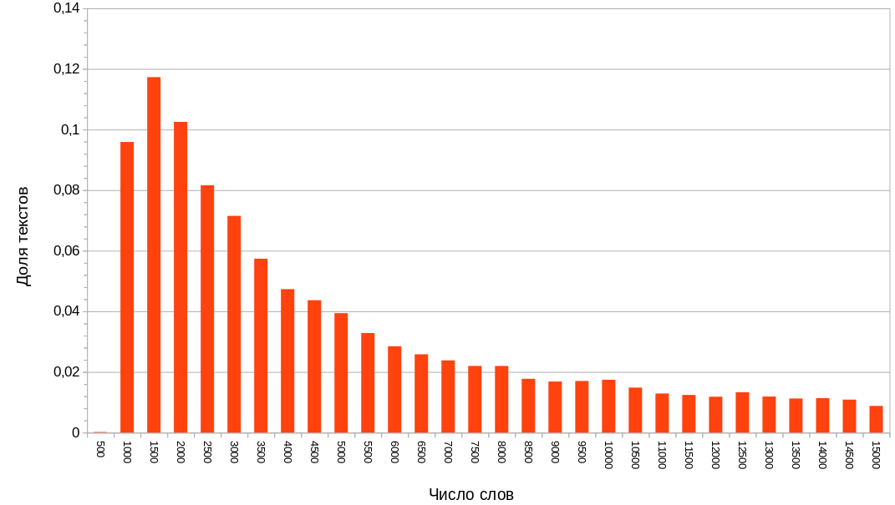

__Определение типа личности по тексту (на замену закрытому IBM Watson Personality Insights)__

Некоторое время назад к нам обратился заказчик с не совсем обычной задачей — воспроизвести сервис IBM Watson Personality Insights, который анализировал текст, написанный человеком и определял по нему ряд личностных характеристик. Задача возникла по причине того, что бизнес заказчика основывался на этом сервисе, в то время как IBM объявила, что сервис вскоре станет недоступен. В этой статье расскажем, что делал этот сервис и чем закончилась задача воспроизведения его функционала.

__Введение. Как устроена эта статья__

Сначала я расскажу, что делал Watson Personality Insights и зачем это было людям нужно. Потом будет описание данных, которые мы получили, структуры модели и основных результатов. Вторая часть написана несколько более сложным языком и рассчитана на специалистов, которые знают, что такое GRU, MLP, BERT, вектора слов и т. п. Если эти подробности вам не близки, то можно эту часть пропустить и прочитать только часть 1-ю и 3-ю части «Обсуждение результатов и анализ примеров», где результаты работы модели представлены более наглядно в интуитивно понятной форме.

Отмечу сразу, что работа описанная в статье была сделана почти два года назад, но соображения конфиденциальности позволили написать о ней только сейчас, поэтому методы и модели примененные в статье для решения задачи на сегодняшний день могли в ряде аспектов устареть. Кроме того, прошу простить, если сложится ощущение, что часть деталей упущена — некоторую информацию о проекте нельзя публиковать, например я не смогу объяснить чем занимался заказчик и зачем ему была нужна эта модель.

С этими оговорками, можем наконец перейти к делу.

__Что делал Watson Personality Insights__

Основная идея данного сервиса состояла в том, что он получает на вход текст написанный определенным человеком и определяет по этому тексту четыре группы характеристик личности.

1. Шкалы «Большая пятёрка»
2. Потребности
3. Ценности
4. Покупательские предпочтения

__«Большая пятёрка»__ это психологическая модель описания личности через 5 основных свойств. В отличие от многих популярных тестов, «большая пятёрка» имеет под собой научную основу (многие исследователи считают, что это единственная модель свойств личности, которая имеет научное обоснование).

История создания этой модели коротко такова. В начале XX века несколько исследователей, независимо друг от друга пытались изучать способы, которыми люди описывают характеристики других людей. Они брали описания вроде «этот человек злобный» или «всегда выполняет работу добросовестно» и выделяли из них описательные слова (злобный, добросовестно…). Эта идея берет свое начало в «лексической гипотезе» высказанной Френсисом Гальтоном еще в конце XIX века [1]. Ее суть в том, что любые аспекты человеческой личности так или иначе отражаются в языке и путем изучения языка можно делать выводы о структуре личности. В 40-х годах XX века Гордон Олпорт и Генри Одберт собрали 18000 таких слов и сгруппировали их в 4000 разных характеристик личности. Далее с появлением компьютера другие исследователи начали применять факторный анализ и сократили число сначала до 18, потом до 16, ну и так далее, пока в 70-х годах XX века две группы (группа Поля Косты из Национального Института Здоровья США и Льюиса Голберга из Мичиганского университета) независимо друг от друга не пришли к 5 главным факторам. На основании этих факторов был далее разработан опросник из 240 вопросов [2].

Пять основных факторов получили в итоге названия:

1. экстраверсия,
2. доброжелательность (дружелюбие, способность прийти к согласию),
3. добросовестность (сознательность),
4. нейротизм (эмоциональная нестабильность, негативные эмоции, эмоциональный диапазон)
5. открытость опыту

(в литературе встречаются разные варианты названий и их переводов, поэтому приведено несколько названий в скобках)

Внутри 5 главных факторов также можно выделить отдельные аспекты, до 7 штук на каждый основной фактор.

__Потребности__. Личные потребности описывают 12 измерений аспектов личности, которые могут резонировать с данным человеком: волнение, гармония, любопытство, идеал, близость, самовыражение, свобода, любовь, практичность, стабильность, вызов и структура. Потребности судя по всему продукт внутренних исследований IBM, по крайней мере ссылки на описание потребностей, которые мне удалось найти ведут только на страницы документации сервиса (которые сейчас более недоступны).

__Ценности__. Ценности, которые важны для человека и могут влиять на поведение при принятии решений помощь другим, традиции, удовольствие от жизни, достижения и открытость к изменениям. Эти ценности основаны на работе Шварца «Основные человеческие ценности: теория, измерение и приложения». [3], в которой автор с помощью опросов пытался найти ценности, встречающиеся во всех культурах. Шварц выделяет 10 различных ценностей, но Personality Insights умел определять пять: консерватизм/сохранение, открытость к изменениям, гедонизм, самосовершенствование, самопревосхождение (conservation, openness to change, hedonism, self-enhancement, self-transcendence)

Характеристики личности представляют собой числа от 0 до 1, причем это не значения шкал непосредственно, а персентили, т. е. 0.9 по шкале «доброжелательность» означает, что человек входит в 10% самых доброжелательных людей (среди популяции, на которой разрабатывался сервис, т. е. например для английского языка это англоговорящие люди).

__Потребительские предпочтения__. Судя по техническому отчету IBM [4] характеристики личности можно использовать для предсказания предпочтений в товарах/услугах, так как существует корреляция между свойствами личностью и тем, что человеку нравится/не нравится. Корреляция это статистическая, т. е. имея конкретного человека нельзя на 100% сказать, что вот он будет смотреть фильмы ужасов, или там покупать шоколадные батончики, но имея группу людей можно выделить аудиторию, которая с большей вероятностью будет склонна или не склонна покупать определенные группы товаров.

Watson непосредственно определял 41 параметр касающийся предпочтений человека, вроде «Ценит качество», «Любит фильмы ужасов», «Ценит безопасность продукта» и т. п. Их можно условно сгруппировать на общие («Ценит безопасность продукта», «Озабочен влиянием на экологию»), принцип выбора продуктов («По бренду», «Под влиянием соц. Сетей»), предпочтения в музыке, фильмах и книгах.

Данные параметры могут иметь только три фиксированных значения — 0, 0.5 или 1 где 0 означает отсутствие признака, 1 — присутствие, а 0.5, присутствие до определенной степени

__Применения и этические аспекты__

Может показаться, что Personality Insights это исключительно вредный и общественно опасный продукт для вторжения в личную жизнь. Собственно, вероятно поэтому он и был закрыт. Поэтому возникает вопрос, насколько правильно публиковать статью о разработке подобного сервиса. Но нужно отметить два важных момента:

1. Существует довольно много общественно полезных применений такой модели. Например, Personality Insights использовался в психотерапии для оценки состояния пациентов [5], в искусстве (оценка личности персонажей пьес Шекспира) [6], определении спама [7] а также в научных исследованиях. Например, исследования установили связь между экологической политикой крупных компаний и личностными характеристиками их директоров [8], а также выявили оптимальные характеристики личности для команды разработчиков ПО [9,10]
2. Наивно полагать, что другие широко используемые модели, например показа таргетированной рекламы, рекомендации музыки и видео, ленты в соцсетях и.т.п. не имеют в каком-то виде репрезентации характеристик личности пользователя. Просто там данный аспект не выпячивается и соответственно не вызывает такой психологической реакции неприятия, но по сути происходит все то же самое.
3. Наконец, исчезновение Watson Personality Insights не привело к исчезновению доступности подобных сервисов — более мелкие компании продолжают их развивать, появляются системы определения личности по видео и т. п. В этом плане сокрытие информации об их устройстве и возможностях не кажется полезным, скорее наоборот, чем больше людей знают о том, что это такое, что может делать и в общих чертах как работает, тем лучше.

__Разработка модели__

__Данные и метрики качества__

Обучающую выборку для этой задачи предоставил заказчик. Где он ее взял достоверно неизвестно — возможно провел собственные исследования, а может быть просто собрал ответы сервиса. В любом случае мы получили таблицу, в которой был текст, написанный человеком и 94 параметра, в целом похожие на то, что выдавал Watson Personality Insights. Всего в таблице было 28000 записей обучающих данных и 2000 — тестовых.

У текстов в выборке оказалось достаточно неравномерное распределение по длине (рис 1).

*Рисунок 1. Распределение текстов по длине*

Распределение не симметричное, максимум приходится на тексты длиной около 1500 слов, но имеется длинный хвост и в итоге существенную долю выборки составляют тексты длиннее 6000 слов.

На сайте Personality Insights качество моделей Watson оценивалось с помощью двух показателей — средней абсолютной ошибки (MAE) и коэффициента корреляции. До того как прийти к нам, заказчик провел свои работы и получил MAE 0.14, соответственно, задача была поставлена получить существенное улучшение по сравнению с ним, и основной метрикой заказчик считал именно MAE.

Данные представляют собой смесь нескольких языков с одним доминирующим (90%) и тремя другими (4%, 3%, 3%). Соглашение с заказчиком не позволяет, к сожалению обозначить конкретные языки набора данных.